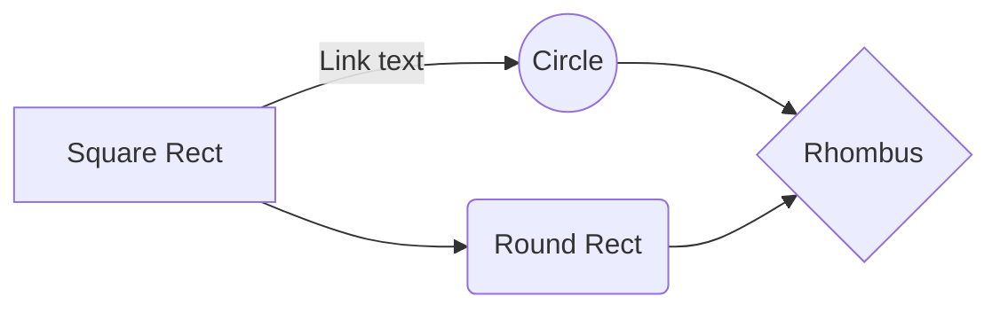

# Description

Robust plate detection recognition software applied to colombian plates. From the raw, noisy and small plates images to a string of the plate using OpenCv, Numpy and Tesseract OCR.

# Files

StackEdit stores your files in your browser, which means all your files are automatically saved locally and are accessible **offline!**

# Requirements

The file explorer is accessible using the button in left corner of the navigation bar. You can create a new file by clicking the **New file** button in the file explorer. You can also create folders by clicking the **New folder** button.

# Blocks diagram

You can render UML diagrams using [Mermaid](https://mermaidjs.github.io/). For example, this will produce a sequence diagram:
And this will produce a flow chart:

